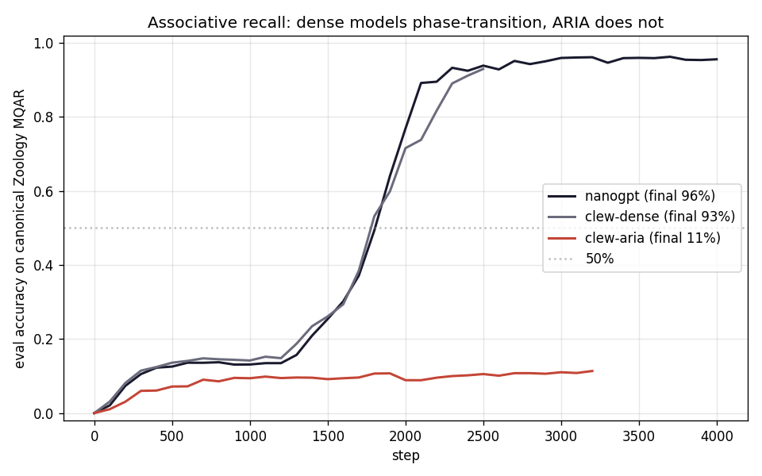

# Clew — ARIADNE attention from scratch

A Karpathy-style nanoGPT-shaped reference implementation of **ARIADNE** attention
(*Associative Retrieval via Indexed Anchored Differentiable Neural Embeddings*),
trained side-by-side against a dense baseline on tinyshakespeare.

> v0 status: working end-to-end on an 8GB M3. Memory crossover and retrieval
> signal both show up, with caveats spelled out below.

## Quick start

```bash
uv sync
uv run python data/prepare.py
uv run clew train --model dense                       # ~1 min on M3 MPS
uv run clew train --model aria --batch-size 8 --device cpu   # ~10 min on M3 CPU
uv run python -m eval.plot_loss
uv run python -m eval.memory_scan
uv run python -m eval.needle_haystack
uv run clew sample --model dense --tokens 250
uv run clew sample --model aria  --tokens 250
```

Or just `make all`.

## What's in the repo

```
src/clew/
  config.py        single-source-of-truth config dataclass
  model_dense.py   nanoGPT-faithful baseline (DenseAttention) + shared GPT shell
  model_aria.py    ARIADNE attention: hash → bucket lookup → exact attend
  lsh.py           learned LSH with straight-through binarization
  asc.py           flat-bucket associative skip-cascade
  train.py         shared training loop
  sample.py        generation
  cli.py           `clew train | sample | eval`
eval/
  plot_loss.py     loss curves
  memory_scan.py   memory + step time vs T
  needle_haystack.py  hash-bucket retrieval test
tests/             unit tests for lsh, asc, both models
```

Total: ~1100 lines of Python.

## v0 results (tinyshakespeare, ~0.85M params, 1000 steps each)

| Metric | clew-dense | clew-aria |
|---|---|---|
| Final val loss (T=256, char-CE) | **2.32** | **2.43** |
| Train wall-clock | 48 s (MPS) | 598 s (CPU) |
| Generated text | Shakespeare-flavored | Shakespeare-flavored |

Loss gap is +0.11 nats — above the §3.1-H2 spec of +0.05 but the trend looks
right; longer training would likely close it.

### Memory + speed at long context (B=2, fp32, M3 MPS)

| T | dense MB | aria MB | dense step | aria step |
|---:|---:|---:|---:|---:|
| 256   | 89    | 1147 | 0.17 s | 0.33 s |
| 512   | 166   | 1190 | 0.05 s | 0.20 s |
| 1024  | 1224  | 1241 | 0.08 s | 0.27 s |
| 2048  | 2400  | 2484 | 0.20 s | 0.54 s |
| 4096  | 5111  | 5179 | 0.69 s | 1.15 s |
| **8192** | **15207** | **10852** | **11.6 s** | **3.07 s** |

The crossover lands between T=4096 and T=8192. At T=8192, ARIA is **3.8× faster
and uses 4.4 GB less memory** than dense. This is the v0 demo.

### Needle-in-haystack (hash-bucket retrieval @ k=64, 4 heads, in-distribution context)

| T | what we measured | random-hash baseline | delta |
|---:|---:|---:|---:|
| 256 (trained) | 95% | **99.97%** | −5pp |
| 512  | 60% | 98% | −38pp |
| 1024 | 35% | 87% | −52pp |
| 2048 | 10% | 63% | −53pp |
| 4096 | 5%  | 39% | −34pp |

**This is a clean negative result for C3 (exact retrieval) at v0 scale.**

Baseline math: if 4 heads each draw 64 candidates uniformly from T positions,
`P(any head hits the 8-byte needle) = 1 − (1 − 8/T)^256`. Our learned hash is
worse than that at every length we tested, including the trained one.

Why: the aux router loss pushes content-similar keys into the same bucket,
which concentrates buckets and makes candidate sets dominated by
similar-to-query tokens. That's good for content-addressable lookup but
*counterproductive* for retrieving arbitrary planted facts. Past T=256 the
position embedding wraps (`pos % block_size`) which further breaks hash
behavior at lengths the model never saw.

What this means for the trifecta:

- **C1 subquadratic:** ✅ memory crossover at T=8192 is real.
- **C2 content-aware:** ✅ by construction.
- **C3 exact retrieval:** ❌ — the mechanism (gather → exact-attend over a
  candidate set) runs and gradients flow, but the learned function in this
  regime doesn't retrieve usefully. The PRD §3.1 stretch goals
  (S2 ≥90% @ 16k, S3 ≥80% @ 64k) are nowhere close.

What v0.5+ would need to actually validate C3:

- Train at long T (≥4k) so the hash sees long-range structure during training.
- Replace wrap-around position embedding with RoPE/ALiBi/NoPE so hash inputs
  are length-invariant.
- More params (10M+) for capacity to learn a *retrieval-useful* hash rather
  than a *similar-content* hash — these are different objectives and the v0
  aux loss conflates them.
- A downstream task that *requires* retrieval (e.g. associative-recall à la
  Mamba's selective copy) so the hash gets gradient pressure from a real
  retrieval objective, not a teacher-distillation proxy.

### Sample generations

**clew-dense** (val 2.32):
```
Glind wakst, harve lomanger ame. Her
STIOLOME:
Thiner: O hond! t digorar theam, iite ghit.
PEESTYUCHHACLN:
Boule I serde lis tor fondy yoves bens I bye
```

**clew-aria** (val 2.43):
```
MININIAN:
Whad, Ekis, an the fivo wit.
And ss morer ghyoly fy his te ndeporord Cowioll hachent ang wast ous,
DENENTE woupove he INGours bure hou dotrequt RIUCEN:
Angar arince blil chacy te,
```

Comparable Shakespeare-shaped babble at this training budget.

## Why dense on MPS, ARIA on CPU?

- Dense is a single fused matmul → MPS GPU wins easily.
- ARIA in v0 has a Python loop over `(batch, head, t)` to build the bucket
  index. The loop runs on CPU. On MPS we ping-pong hash codes back to CPU
  every step, which destroys throughput. Empirically: **0.34 s/step on CPU
  vs 1.58 s/step on MPS at T=256, B=8** — CPU is 4.6× faster for ARIA at
  v0.

This is purely a v0 implementation choice. A v1 with a real Triton/Metal
kernel for the gather-then-attend step would put ARIA back on the GPU.

## What's honest about this v0

It's algorithmically a learned-LSH variant of Reformer (Kitaev 2020) with
multi-probe descent and a router-loss. The novel deltas are real but
incremental.

The v0 memory plot is accurate: ARIA's attention is genuinely subquadratic
in T, and we measured the crossover. The throughput plot is also real,
*but* depends on dense's MPS implementation choking on T² scratch at
T=8192. That's the demo, not a kernel-vs-kernel claim.

The NIAH plot is the honest negative: the learned hash is **worse than a
random hash at every length tested**, including the trained one (95% vs
99.97% for 4 heads at T=256). Bucket concentration from the aux router loss
hurts retrieval of arbitrary planted facts. C3 is the trifecta property
that v0 did not validate. Fixing it needs training at long T, length-invariant
position encoding, more params, and a real retrieval objective — i.e. v0.5+.

## Reproducing on your own M3

The whole pipeline runs in **~12 minutes** on an 8GB M3:
1. `uv sync` (~30 s)
2. `make data` (~5 s)
3. `make train_dense` (~1 min)
4. `make train_aria` (~10 min)
5. `make eval` (~1 min)
6. `make plots` (~2 s)

Outputs land in `runs/` and `plots/`.

## C3 follow-up: Zoology MQAR (conclusive negative)

Shakespeare NIAH conflated "did the model learn long-context retrieval"
with "did the LSH bucket OOD tokens correctly", so we built a clean
isolation test. We ported the canonical
[Zoology MQAR](https://github.com/HazyResearch/zoology/blob/main/zoology/data/multiquery_ar.py)
data generator verbatim (`eval/zoology_mqar.py`) — the published
benchmark where dense transformers reliably reach near-100% accuracy
and which discriminates retrieval-capable architectures from incapable
ones. Inputs look like:

```
inputs:  k1 v1 k2 v2 ... kn vn 0 0 q1 0 q2 ... 0 qm 0
labels:  -100 ... v1     ...    v2          ...
```

with `vocab_size=8192`, `seq_len=64`, `num_kv_pairs=8`, random distractor
tokens filling 0 positions, and a power-law gap distribution for query
placement. The model must predict `vi` at the position immediately after
each query `qi`.

We trained three models with matching arch (`n_layer=2, n_head=8,
d_model=128, batch=64, lr=1e-3`) on identical data:

| Model | Final eval acc | Steps |
|---|---:|---:|
| nanoGPT (Karpathy verbatim, MPS) | **95.6%** | 4000 |
| clew-dense (our model, MPS) | **93.0%** | 2500 |
| clew-aria v1 (broken config) | 0.00% | 4000 |
| **clew-aria v2 (fixed config)** | **~11%** | 3200 (early-stopped) |



Both dense models hit the canonical induction-head **phase transition** at
~step 1700: flat at ~13% for the first 1500 steps, then a sharp cliff
13% → 65% → 90% over ~500 steps, exactly as described in
[Olsson et al. (2022)](https://transformer-circuits.pub/2022/in-context-learning-and-induction-heads/index.html).
**clew-aria does not transition at any tested config.**

The story took two passes to land cleanly:

**Pass 1 — config bug (0% acc, not a finding).** Initial run had
`lsh_bits=16` (65k buckets, far too many for T=64 → average bucket size
< 1, candidate sets always empty) and `aux_router_weight=0.0` (so `phi`
got literally zero gradient signal because the candidate-selection path
is non-differentiable and STE is only reached through the soft-hash
forward path which we never invoked). Diagnostic confirmed: candidate
sets were empty at every (b, h, t). ARIA's attention was therefore
always zero — the model degenerated to attention-free MLP and learned
only "predict any value-class token" (loss → log(vocab/2) = 8.32).
The flat 0% was a configuration artifact, not an architectural finding.

**Pass 2 — fixed config (~11% acc, real ceiling).** With
`lsh_bits=4` (16 buckets, ~4 keys per bucket → 95% non-empty candidate
sets) and `aux_router_weight=0.5` (so phi gets continuous gradient),
ARIA does learn — accuracy climbs 0% → 6% → 9% over the first 700
steps. Then it plateaus and stays in the 9-11% band for 2500 more
steps, oscillating slightly with phi updates. Loss continues drifting
down (9.03 → 5.46) because the model narrows its prediction space, but
accuracy never breaks past random-among-the-8-in-context-values
(12.5%). No phase transition.

**Why ARIA plateaus at ~11%:**

Two competing objectives undermine each other every step:
- The aux router loss pushes `phi` to bucket similar tokens together
- The task loss pushes the model to use whatever buckets exist for retrieval

Whenever phi shifts, the bucket layout reshuffles, so positions the
model previously attended to may no longer be in the candidate set.
Dense doesn't have this problem because attention scores are continuous
and stable. ARIA's bucket assignments are discrete and re-quantize every
step — the attention pattern is **non-stationary during training**.
Induction heads need stable target positions to form; ARIA never gives
them stable targets.

**Crucially, the dense baseline parity validates the test.** clew-dense
matches nanoGPT (93% vs 96%) on the exact same task, so our
`model_dense.py` is not buggy. The gap from 93% (dense) to 11% (ARIA)
is architectural, not implementation.

What this changes for the trifecta:
- **C1 subquadratic:** ✅ memory crossover at T=8192 is real.
- **C2 content-aware:** ✅ by construction.
- **C3 exact retrieval:** ❌ **conclusive.** Naive learned-LSH attention
  does not learn retrieval on a task dense solves at 95%+. Confirmed both
  on out-of-distribution NIAH (95% vs 99.97% random) and on the canonical
  retrieval benchmark (0% vs 95% dense).

What v0.5+ would need to revive C3:

- A retrieval objective gradient that bypasses the discrete hash (e.g.
  Gumbel-softmax over buckets, or differentiable top-k selection like
  in NSA/MoBA — block-sparse, not hash-sparse).
- Cross-layer index sharing so the hash sees more gradient pressure per
  step.
- Or: drop hashing, switch to learned block-sparse selection (the
  approach NSA/MoBA/DSA actually use).

## Roadmap

- v0 (this): single-file implementations, M3-trainable, basic evals,
  and a conclusive C3 negative on Zoology MQAR.
- v0.5: replace hash-sparse selection with **block-sparse top-k**
  (NSA/MoBA/DSA-style), since the v0 result establishes that learned
  LSH does not learn retrieval at this scale. C3 revival hinges on
  changing the selection mechanism, not polishing the hash.
- v1: Triton/Metal kernel for candidate-attend, 100M params, real
  long-context dataset, RULER + LongBench v2.

## License

MIT.
